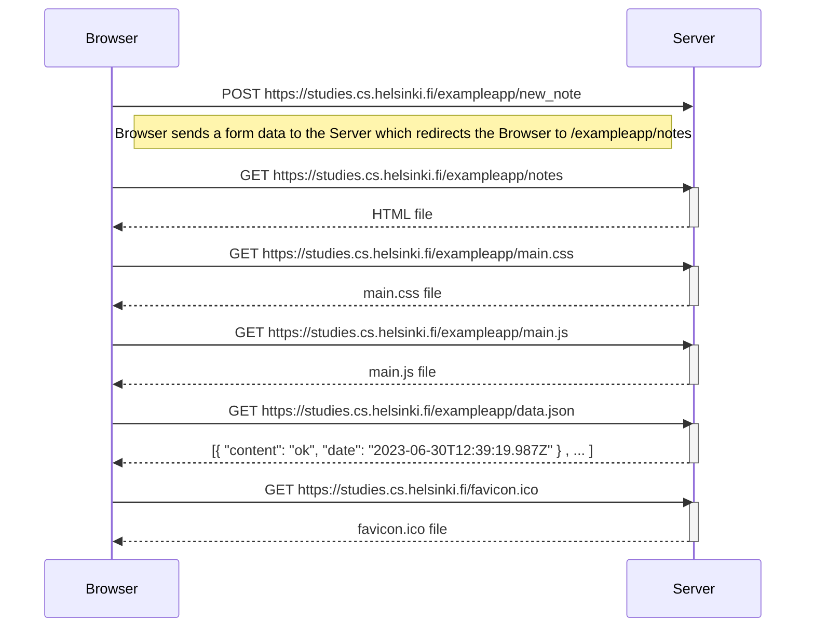

```mermaid
sequenceDiagram
    participant Browser
    participant Server

    Browser->>Server: POST https://studies.cs.helsinki.fi/exampleapp/new_note
    Note right of Browser: Browser sends a form data to the Server which redirects the Browser to /exampleapp/notes

    Browser->>Server: GET https://studies.cs.helsinki.fi/exampleapp/notes

    activate Server
    Server-->>Browser: HTML file
    deactivate Server

    Browser->>Server: GET https://studies.cs.helsinki.fi/exampleapp/main.css

    activate Server
    Server-->>Browser: main.css file
    deactivate Server

    Browser->>Server: GET https://studies.cs.helsinki.fi/exampleapp/main.js
    activate Server
    Server-->>Browser: main.js file
    deactivate Server

    Browser->>Server: GET https://studies.cs.helsinki.fi/exampleapp/data.json
    activate Server
    Server-->>Browser: [{ "content": "ok", "date": "2023-06-30T12:39:19.987Z" } , ... ]
    deactivate Server

    Browser->>Server: GET https://studies.cs.helsinki.fi/favicon.ico
    activate Server
    Server-->>Browser: favicon.ico file
    deactivate Server

```