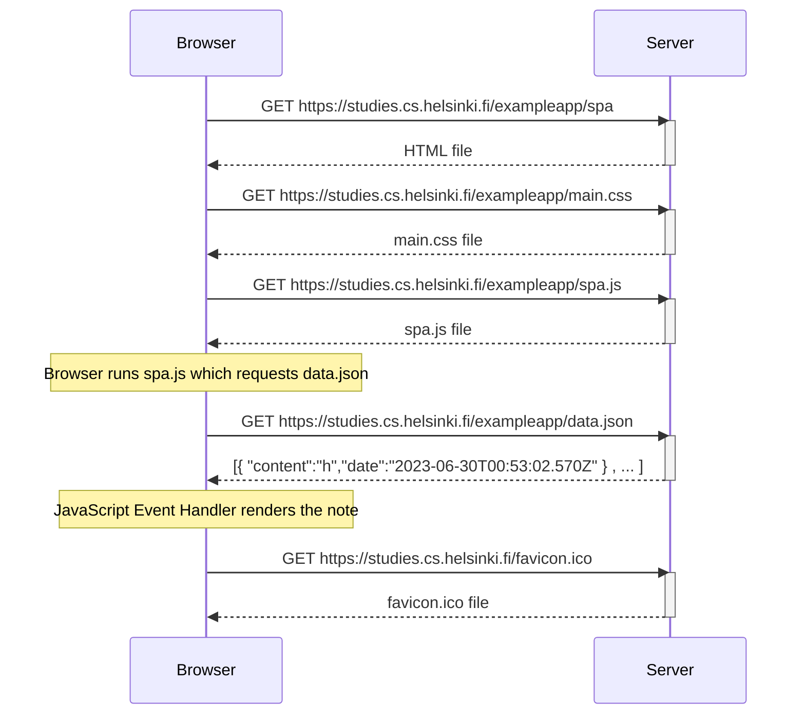

```mermaid
sequenceDiagram
    participant Browser
    participant Server

    Browser->>Server: GET https://studies.cs.helsinki.fi/exampleapp/spa
 

    activate Server
    Server-->>Browser: HTML file
    deactivate Server

    Browser->>Server: GET https://studies.cs.helsinki.fi/exampleapp/main.css

    activate Server
    Server-->>Browser: main.css file
    deactivate Server

    Browser->>Server: GET https://studies.cs.helsinki.fi/exampleapp/spa.js
    activate Server
    Server-->>Browser: spa.js file
    deactivate Server

    Note over Browser: Browser runs spa.js which requests data.json

    Browser->>Server: GET https://studies.cs.helsinki.fi/exampleapp/data.json
    activate Server
    Server-->>Browser: [{ "content":"h","date":"2023-06-30T00:53:02.570Z" } , ... ]
    deactivate Server

    Note over Browser: JavaScript Event Handler renders the note

    Browser->>Server: GET https://studies.cs.helsinki.fi/favicon.ico
    activate Server
    Server-->>Browser: favicon.ico file
    deactivate Server

```