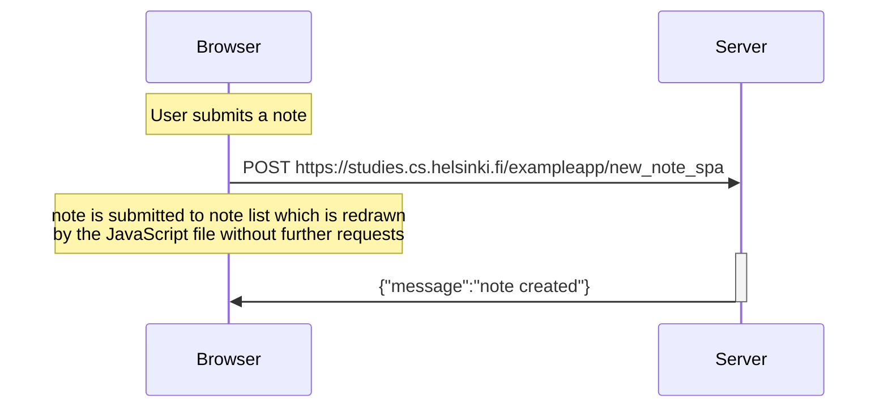

```mermaid
sequenceDiagram
    participant Browser
    participant Server

    Note over Browser: User submits a note

           Browser->>Server: POST https://studies.cs.helsinki.fi/exampleapp/new_note_spa

            Note over Browser: note is submitted to note list which is redrawn<br /> by the JavaScript file without further requests       
 
        activate Server
        Server->>Browser: {"message":"note created"}
        deactivate Server


```